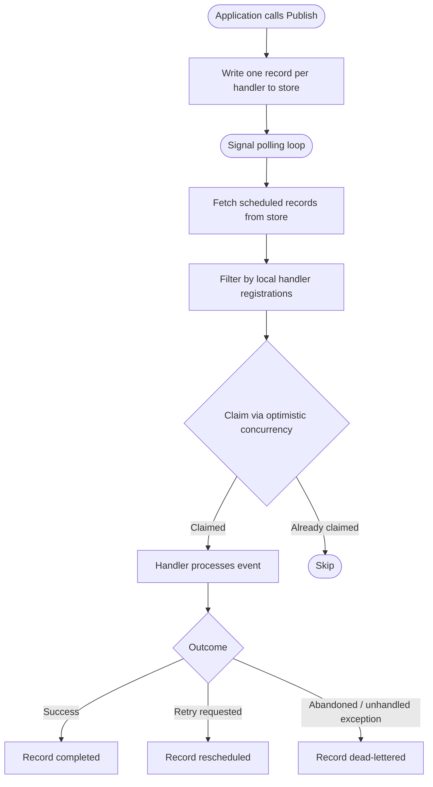
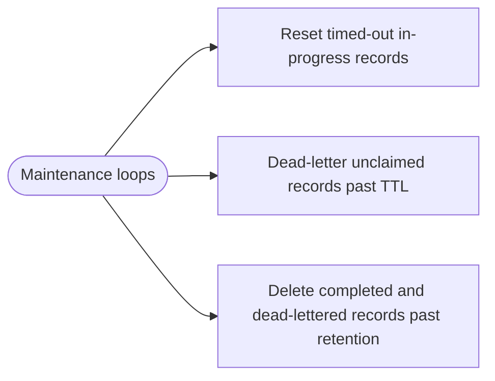

# EventBrokerSlim Persistent Events

---

## Purpose

This document describes the goals, assumptions, and architecture decisions behind the persistent events feature of `EventBrokerSlim`. It is intended for contributors seeking to understand the reasoning behind the design, and for adopters evaluating whether the feature fits their use case.

It does not cover implementation details or backend-specific concerns.

---

## When to Use This Feature

*Informally: a poor man's queue with fan-out.*

### The Landscape

Several .NET libraries address reliability and background processing. Understanding where they sit helps clarify where EventBrokerSlim fits.

**Job schedulers - Hangfire, Quartz.NET, Coravel, TickerQ.** These persist and execute explicitly enqueued work. You schedule a job, a worker picks it up and runs it. They support retries, recurring schedules, and monitoring dashboards. None of them have fan-out - if three things need to happen when an order is placed, you enqueue three jobs, and the coupling lives in the caller.

**Distributed messaging frameworks - MassTransit, Rebus, Wolverine, Brighter.** These support fan-out via message routing and provide durable delivery, sagas, and consumer registration. They abstract over real message brokers (RabbitMQ, Azure Service Bus) or provide their own transport. Capable and well-supported, but they are framework-level commitments with significant infrastructure and learning curve.

**Message brokers - RabbitMQ, Azure Service Bus, Amazon SQS.** The right tool for cross-service event distribution, heterogeneous consumers, and high-throughput messaging. Require dedicated infrastructure, operational expertise, and introduce a network hop and a new failure domain.

| Library | Fan-out | Persistence | Scheduling | Scope |
|---|---|---|---|---|
| EventBrokerSlim | ✓ | ✓ | ✗ | Narrow, focused |
| Hangfire | ✗ | ✓ | ✓ | Background jobs |
| Quartz.NET | ✗ | ✓ | ✓ | Job scheduling |
| Coravel | ✗ | ✗ | ✓ | Lightweight scheduling |
| TickerQ | ✗ | ✓ | ✓ | Time-based jobs |
| Wolverine | ✓ | ✓ | ✓ | Full framework |
| Brighter | ✓ | ✓ | ✗ | Command/event dispatch |
| MassTransit | ✓ | ✓ | ✓ | Distributed messaging |
| Rebus | ✓ | ✓ | ✗ | Distributed messaging |

### Where EventBrokerSlim Fits

EventBrokerSlim with persistent events sits in the gap between job schedulers and distributed messaging frameworks. It is not a job scheduler - there is no explicit enqueue, no cron scheduling, no job chaining. It is not a distributed messaging framework - there is no broker, no transport, no cross-service routing.

It is a **durable in-process event bus** - publish an event, every registered handler runs at least once, reliably, even across crashes and restarts, across multiple instances of the same application.

### Advantages

**Fan-out with decoupling.** One publish, multiple independent handlers, each with its own delivery guarantee and retry policy. The publisher knows nothing about the handlers. Adding a new handler requires no change to the publisher.

**DI-native programming model.** Handlers are plain classes resolved from your DI container - or delegates composed via pipelines. Each handler decides its own retry policy independently, and retry policies are code, not configuration. No serialization contracts, no consumer group configuration, no broker-specific concepts to learn.

**Uses infrastructure you already have.** Persistence runs on your existing database - relational, document, or embedded. No new infrastructure to provision, operate, or monitor. For embedded backends (SQLite, Firebird) not even a database server is needed.

**Narrow scope, low commitment.** It does one thing - durable in-process fan-out - and does not grow into a framework. Adopting it does not constrain your architecture or require you to buy into a broader ecosystem.

**Coexists with other tools.** EventBrokerSlim handles durable in-process fan-out; job schedulers handle scheduled and background jobs; message brokers and distributed messaging frameworks handle cross-service event distribution. They solve different problems and work naturally alongside each other.

### When to Choose Something Else

- Cross-service event distribution, heterogeneous consumers → message broker or distributed messaging framework
- Scheduled or recurring background jobs → Hangfire, Quartz.NET, or TickerQ
- Event sourcing, audit log, replay → dedicated event store
- Complex workflow orchestration, sagas → MassTransit, Wolverine, or NServiceBus

### The Bottom Line

EventBrokerSlim with persistent events fills the gap below message brokers - where their operational overhead is not justified, but the in-memory-only broker is not reliable enough.

---

## Goals

**Durability.** Published events must not be lost if the process crashes before all handlers have completed. Every handler must eventually process every event it is registered for, even across process restarts.

**Durable retries.** Handler retry policies must survive process restarts. An event that failed and is awaiting a retry must remain in that state after a crash and be retried correctly when the process comes back up.

**Horizontal scale-out.** Multiple instances of the same application must be able to run concurrently. The claiming mechanism ([ADR-03](ADRs/ADR-03-optimistic-claiming-broad-polling.md)) must ensure that, under normal operation, at most one instance processes a given record. In failure scenarios (process crash after claim, before ack), a record may be processed more than once - this is the at-least-once trade-off documented in Assumptions.

**Non-breaking.** The existing public interface of `EventBrokerSlim` must remain unchanged. Existing handler code, retry policies, delegate handlers, and DI registrations must require zero modifications to benefit from persistence.

**Opt-in.** Persistence is an additive feature. Applications that do not need it are unaffected. It is enabled entirely through DI registration.

**Pluggable backends.** The persistence mechanism must be replaceable. Server-based relational databases (SQL Server, PostgreSQL), non-relational databases (MongoDB, Redis, CosmosDB), and embedded databases (SQLite, LiteDb, Firebird) must all be supportable through a common abstraction. Embedded backends target single-instance durability and development scenarios; server-based backends target production horizontal scale-out.

---

## Non-Goals

**Not an event sourcing solution.** The store is a delivery mechanism, not an event log. Records exist to ensure handlers execute reliably - they are not a source of truth, do not represent the full history of what happened in the system, and are not intended for replay, projection, or audit. Completed records are deleted according to retention policy. Applications that need event sourcing should use a dedicated solution.

**Not a transactional outbox.** The event write is not atomic with the caller's own database transaction. Supporting this would require sharing the caller's database connection and transaction, constraining the design to same-database relational deployments only and coupling the event store interface to transaction management concerns. Applications that need true transactional outbox semantics should use a dedicated solution such as MassTransit, NServiceBus, or Wolverine. `EventBrokerSlim` provides at-least-once delivery across process restarts, which is sufficient for the majority of durability use cases.

---

## Out of Scope

The following topologies and backends were evaluated and explicitly excluded. While Non-Goals above define what the feature does not try to be, this section covers specific designs that were considered and rejected during development.

### Queue backends (RabbitMQ, Azure Storage Queues, Azure Service Bus)

Queue backends were explored and excluded. The [fan-out at write time](ADRs/ADR-01-fan-out-at-write-time.md) strategy requires one queue per handler name - each handler type needs its own queue so that messages can be consumed independently. This is viable but means using a queue as a queryable database with worse querying capabilities. A database does this job better and more simply.

More fundamentally, the moment you need a queue with fan-out and independent per-handler delivery, you are in message broker territory. That problem is already solved by RabbitMQ exchanges, Azure Service Bus topic subscriptions, and similar infrastructure. Replicating that inside `EventBrokerSlim` would be building a message broker, which is explicitly not the goal.

### Publisher-only processes

A process with no handler registrations at all writes zero records to the store - it has nothing to fan out to. This is a direct consequence of [fan-out at write time](ADRs/ADR-01-fan-out-at-write-time.md): the publisher writes records only for handlers it knows about in its own DI container.

Partial deployments - where different instances have different subsets of handlers - work naturally. Each instance writes records for the handlers it knows about, and any instance with a matching handler will eventually claim and process them. Records for handlers that no instance ever registers remain pending until TTL or a retention policy cleans them up.

The publisher-only topology - a dedicated process with no real handlers whose sole role is publishing - is supported through `NullPipeline`. Register `NullPipeline.Instance` with the handler names that should participate in fan-out:

```csharp
services.AddEventHandlerPipeline<SomeEvent>(NullPipeline.Instance, handlerName: "SomeEventHandler");
```

`NullPipeline` handler names are included in fan-out (records are written to the store on publish) but excluded from local dispatch (the handler runner does not claim or process them). Separate consumer instances with real handlers registered under the same names claim and process the records from the shared store.

### Cross-service event distribution

Distributing events across heterogeneous services - where different services handle different event types, or where a publisher and consumer are entirely separate applications - is out of scope. This is the core problem that full-scale message brokers exist to solve, and `EventBrokerSlim` deliberately does not compete in that space.

The persistent events feature targets a single application scaled horizontally. The store is a durability mechanism, not a transport.

---

## Assumptions

**A record is only processed if a matching handler is registered.** When Publish is called, records are written for the handler names known to the publishing instance ([ADR-01](ADRs/ADR-01-fan-out-at-write-time.md)). Any instance with a matching handler registered will eventually claim and process the record. An instance without that handler simply never claims it - it does not interfere and does not cause an error. If no running instance has the handler registered, the record remains pending until a TTL or retention policy cleans it up.

**At-least-once delivery is acceptable.** In failure scenarios (process crash after claim, before ack - see [ADR-03](ADRs/ADR-03-optimistic-claiming-broad-polling.md)), an event may be dispatched to a handler more than once. Handlers should be idempotent. This is a standard and documented constraint, not a deficiency.

**Events are serializable.** Because events must be written to a store and later deserialized for re-dispatch, all event types must be serializable. Serialization format and mechanism are the responsibility of each `IEventStorage` implementation ([ADR-08](ADRs/ADR-08-serialization-responsibility.md)) - the core library provides no shared serializer. This is a new requirement that does not exist in the in-memory-only version of the library.

**Handler names are explicit and stable.** Each handler participating in persistence must be registered with an explicit handler name ([ADR-05](ADRs/ADR-05-explicit-event-handler-names.md)). This name is used as the handler identifier in the store. It is not derived from the type name - this is essential for delegate/pipeline handlers, where there is no distinguishable type to derive a name from. The name must be stable across deployments; changing it is a breaking change requiring a migration.

**Event names are explicit and stable.** Each event type participating in persistence must be registered in the event registry with a stable string name ([ADR-05](ADRs/ADR-05-explicit-event-handler-names.md)). The store uses this name rather than the C# type name, so namespace and class renames are non-breaking. Property-level changes (renamed, removed, or retyped properties) remain breaking because deserialization depends on the payload structure.

**Event names are globally unique across broker instances.** The event registry is a global singleton shared across all broker instances (including [keyed](https://learn.microsoft.com/en-us/dotnet/core/extensions/dependency-injection#keyed-services) broker instances) in the same process. The same event type maps to exactly one name, and the same name maps to exactly one event type, regardless of which broker instance publishes or handles it. Event identity is unambiguous across the entire process - reasoning about events, their handlers, and store records is consistent whether working with a single broker or multiple. Applications with multiple broker instances share the same registry.

**The event store is external infrastructure.** The caller is responsible for provisioning and operating the backing database. The library provides schema scripts and client configuration, but operational concerns (backups, monitoring, scaling) are outside its scope.

---

## Operational Considerations for Adopters

Adding persistence introduces real operational overhead that does not exist with the in-memory-only broker. Adopters should be aware of:

**Startup validation.** When persistence is enabled, the application validates handler and event registry consistency at startup ([ADR-06](ADRs/ADR-06-startup-validation.md)). By default, misconfigurations emit warnings; applications can opt in to strict mode to throw on validation errors.

**Database dependency.** The application now depends on an external store being available. Store unavailability will cause Publish to fail.

**Schema management.** Each backend package provides migration scripts. Schema changes across library versions must be applied as part of deployment.

**Dead-letter monitoring.** Records land in a dead-letter state when the retry policy is exhausted, when a handler explicitly abandons the event, or when an exception escapes the pipeline unhandled ([ADR-07](ADRs/ADR-07-escaped-exceptions-dead-letter.md)). Dead-lettered records are not retried automatically. Monitoring and tooling for dead-letter inspection and requeue is necessary for production use.

**Polling interval tuning.** The in-memory signal ([ADR-02](ADRs/ADR-02-polling-service-single-dispatch-path.md)) ensures the publishing process dispatches freshly published events with minimal latency. Other instances discover available work only on their next poll interval - during event spikes, idle instances join processing with a delay up to the polling interval. Shorter intervals reduce cross-instance latency at the cost of more store queries when idle.

**Processing timeout tuning.** The processing timeout ([ADR-10](ADRs/ADR-10-maintenance-and-recovery.md)) must be longer than the longest expected handler execution time. Too short and in-progress records are incorrectly reset to scheduled and dispatched again. Too long and records from crashed instances remain stuck until the next maintenance run. A maximum processing timeouts threshold caps how many times a record can be reset before being dead-lettered, preventing indefinite cycling of a persistently stuck record.

**Unclaimed timeout tuning.** The unclaimed timeout ([ADR-10](ADRs/ADR-10-maintenance-and-recovery.md)) determines how long a scheduled record that is never claimed waits before being dead-lettered. This covers removed handlers, missing consumers, and deferred publishes that no instance ever processes. Should be set comfortably above the expected maximum time between a publish and a consumer coming online.

**Handler name stability.** The handler name supplied at registration ([ADR-05](ADRs/ADR-05-explicit-event-handler-names.md)) is stored in the event store as the handler identifier. Changing it is a breaking change - in-flight records under the old name will never be claimed. Treat handler name changes as migrations.

**Event name stability.** The name registered in the event registry ([ADR-05](ADRs/ADR-05-explicit-event-handler-names.md)) is stored as the event type identifier. Changing it is a breaking change - existing records under the old name cannot be deserialized or claimed correctly. Type renames and namespace changes are safe as long as the registered name does not change. Property-level changes (renamed, removed, or retyped fields) are breaking regardless, as deserialization depends on the payload structure.

**PublishDeferred does not accept a cancellation token.** The method signature does not expose a cancellation token parameter. Deferred publishes use the broker's internal shutdown token and cannot be cancelled by the caller. This is a known interface limitation inherited from the public contract and is not currently planned for change.

**No hosted service integration.** The polling loop ([ADR-02](ADRs/ADR-02-polling-service-single-dispatch-path.md)) and maintenance runner use long-running background tasks rather than the ASP.NET Core hosted service lifecycle. They are not subject to graceful shutdown coordination. Shutdown is triggered by calling the broker's Shutdown method.

---

## Appendix A: Architecture Decision Records

Architecture decisions are documented as individual ADRs in the [`ADRs/`](ADRs/) folder. The sections above reference them where relevant.

| ADR | Title | Summary |
|-----|-------|---------|
| [ADR-01](ADRs/ADR-01-fan-out-at-write-time.md) | Fan-out at write time | One record per handler name written at publish time |
| [ADR-02](ADRs/ADR-02-polling-service-single-dispatch-path.md) | Polling service is the single dispatch path | All dispatch goes through the store polling loop, no in-memory fast path |
| [ADR-03](ADRs/ADR-03-optimistic-claiming-broad-polling.md) | Optimistic concurrency claiming | Broad polling query with in-memory filtering; atomic conditional claim per backend |
| [ADR-04](ADRs/ADR-04-single-table-per-event-handler.md) | One store table, one record per (event, handler name) | Single table, self-contained records, payload duplication accepted |
| [ADR-05](ADRs/ADR-05-explicit-event-handler-names.md) | Explicit event and handler names | Stable string names decouple store identifiers from C# type names |
| [ADR-06](ADRs/ADR-06-startup-validation.md) | Startup validation | Eager validation of handler/event registration consistency at startup |
| [ADR-07](ADRs/ADR-07-escaped-exceptions-dead-letter.md) | Escaped exceptions dead-letter | Unhandled pipeline exceptions bypass retry policy and dead-letter immediately |
| [ADR-08](ADRs/ADR-08-serialization-responsibility.md) | Serialization is backend responsibility | Each IEventStorage implementation owns serialization; no shared serializer |
| [ADR-09](ADRs/ADR-09-single-storage-interface.md) | IEventStorage remains a single interface | ISP split rejected; single interface is better for implementors |
| [ADR-10](ADRs/ADR-10-maintenance-and-recovery.md) | Periodic maintenance for recovery and cleanup | Three independent loops: processing timeout reset, unclaimed TTL dead-lettering, completed and dead-lettered record deletion |

---

## Appendix B: How It Works

### Publish and dispatch

The following diagram shows how events flow from Publish through the polling loop to handler dispatch. Each record is self-contained ([ADR-04](ADRs/ADR-04-single-table-per-event-handler.md)). See also [ADR-01](ADRs/ADR-01-fan-out-at-write-time.md) (fan-out at write), [ADR-02](ADRs/ADR-02-polling-service-single-dispatch-path.md) (single dispatch path), and [ADR-03](ADRs/ADR-03-optimistic-claiming-broad-polling.md) (claiming).



### Maintenance

Three independent periodic loops handle recovery and cleanup. See [ADR-10](ADRs/ADR-10-maintenance-and-recovery.md).


