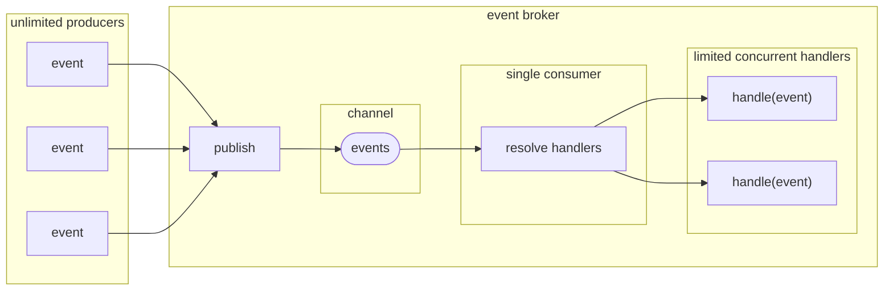

# EventBrokerSlim  
  

[](https://github.com/petar-m/EventBrokerSlim/actions)
[](https://www.nuget.org/packages/M.EventBrokerSlim)    

An implementation of broadcasting events in a fire-and-forget style.  

Features:  
- in-memory, in-process
- publishing is *Fire and Forget* style  
- events don't have to implement specific interface  
- event handlers are executed on a `ThreadPool` threads  
- the number of concurrent handlers running can be limited  
- built-in retry option
- tightly integrated with `Microsoft.Extensions.DependencyInjection`
- each handler is resolved and executed in a new DI container scope
- event handlers can be a [pipeline](https://github.com/petar-m/EventBrokerSlim/blob/main/FuncPipeline/ReadMe.md) of delegates  
- dynamic adding and removing of delegate event handler pipelines  
- multiple independent event broker instances in the same process

# How does it work

Implement an event handler by implementing `IEventHandler<TEvent>` interface:

```csharp
public record SomeEvent(string Message);

public class SomeEventHandler : IEventHandler<SomeEvent>
{
    // Inject services from DI container
    public SomeEventHandler()
    {
    }

    public async Task Handle(SomeEvent @event, IRetryPolicy retryPolicy, CancellationToken cancellationToken)
    {
        // process the event
    }

    public async Task OnError(Exception exception, SomeEvent @event, IRetryPolicy retryPolicy, CancellationToken cancellationToken)
    {
        // called on unhandled exception from Handle 
        // optionally use retryPolicy.RetryAfter(TimeSpan)
    }
}
```  

or create `IPipeline` of delegates to handle the event: 

```csharp
IPipeline pipeline = PipelineBuilder.Create()
      .NewPipeline()
      .Execute(static async (SomeEvent someEvent, ISomeService service, CancellationToken cancellationToken) =>
      {
          await service.DoSomething(someEvent, cancellationToken);
      })
      .Build()
      .Pipelines[0];
```  

Add event broker to DI container using `AddEventBroker` extension method and register handlers:

```csharp
serviceCollection
    .AddEventBroker()
    .AddTransientEventHandler<SomeEvent, SomeEventHandler>()
    .AddEventHandlerPipeline<SomeEvent>(pipeline);
```

Inject `IEventBroker` and publish events:

```csharp
class MyClass
{
    private readonly IEventBroker _eventBroker;

    public MyClass(IEventBroker eventBroker)
    {
        _eventBroker = eventBroker;
    }
    
    public async Task DoSomething()
    {
        var someEvent = new SomeEvent("Something happened");
        await _eventBroker.Publish(someEvent);
    }
}
```

# Overview  

`EventBroker` uses `System.Threading.Channels.Channel<T>` to decouple producers from consumers.  

There are no limits for publishers. Publishing is as fast as writing an event to a channel.  

Event handlers are resolved by event type in a new DI scope which is disposed after the handler completes. Each handler execution is scheduled on the `ThreadPool` without blocking the producer. No more than configured maximum handlers run concurrently.
  


# Details

## Events

Events can be of any type. A good practice for event is to be immutable - may be processed by multiple handlers in different threads.  

## Event Handlers

Event handlers can be specified in two ways:
- By implementing `IEventHandler<TEvent>` interface and registering the implementation in the DI container.
- By building an `IPipeline` of delegates and registering it in the DI container.  

Both approaches can be used side by side, even for the same event. No matter how handlers are specified, a new DI container scope is created for each event handler. Every event handler is scheduled for execution on the `ThreadPool` without blocking the producer.  

### Event Handlers Implementing `IEventHandler<TEvent>`  

When event of type `TEvent` is published, `EventBroker` will resolve each `IEventHandler<TEvent>` implementation from a dedicated scope. This means that additional dependencies can be injected via the handler constructor, also resolved from the same scope.  

The parameters of `IEventHandler<TEvent>` methods are managed by `EventBroker`.  
```csharp
Task Handle(TEvent @event, IRetryPolicy retryPolicy, CancellationToken cancellationToken);

Task OnError(Exception exception, TEvent @event, IRetryPolicy retryPolicy, CancellationToken cancellationToken);
```
- `TEvent` - the instance of the published event.  
- `IRetryPolicy` - the instance of the retry policy for the handler (see [Retries](#retries) section).
- `CancellationToken` - the `EventBroker` cancellation token.
- `Exception` - exception thrown from `Handle`.

Since event handlers are executed on the `ThreadPool`, there is nowhere to propagate unhandled exceptions.  
An exception thrown from `Handle` method is caught and passed to `OnError` method of the same handler instance (may be on another thread however).  
An exception thrown from `OnError` is handled and swallowed and potentially logged (see [Logging](#logging) section).  

### Delegate Event Handlers

EventBroker uses the [FuncPipeline]() library for creating and executing a pipeline of delegates for given event.

```csharp
IPipeline pipeline = PipelineBuilder.Create()
      .NewPipeline()
      .Execute(static async (ILogger logger, INext next) =>
      {
          try
          {
             await next.RunAsync();
          }
          catch(Exception exception)
          {
             logger.LogError(exception);
          }
      })      
      .Execute(static async (SomeEvent someEvent, ISomeService someService, CancellationToken ct) =>
      {
          await someService.DoSomething(ct);
      })
      .Build()
      .Pipelines[0];

serviceCollection.AddEventHandlerPipeline<SomeEvent>(pipeline);
```

All delegate parameters are resolved from DI container scope and passed when the delegate is invoked.  
There are optional parameters available out-of-the-box:
- `TEvent` - an instance of the event being handled. Should match the type of the event the delegate was registered for.
- `IRetryPolicy` - the instance of the retry policy for the handler (see [Retries](#retries) section).
- `CancellationToken` - the `EventBroker` cancellation token. 
- `INext` - used to call the next delegate in the pipeline.

Delegate handlers do not provide special exception handling. Exception caused by resolving services or  unhandled exception during execution will be handled and swallowed and potentially logged (see [Logging](#logging) section).  

### Dynamic Delegate Event Handlers 

Delegate handlers can be added or removed after DI container was built. Dynamic delegate handlers are `IPipeline` instances. 

`IServiceCollection.AddEventBroker()` registers `IDynamicEventHandlers`, used for managing handlers. Adding a handler returns `IDynamicHandlerClaimTicket`, used to remove the handler.

```csharp
public class DynamicEventHandlerExample : IDisposable
{
    private readonly IDynamicEventHandlers _dynamicEventHandlers;
    private readonly List<IDynamicHandlerClaimTicket> _claimTickets = new();

    public DynamicEventHandlerExample(IDynamicEventHandlers dynamicEventHandlers)
    {
        _dynamicEventHandlers = dynamicEventHandlers;

        // Define two handlers for different events
        var builder = PipelineBuilder.Create()
            .NewPipeline()
            .Execute<Event1, IRetryPolicy, ISomeService>(HandleEvent1)
            .Build()
            .NewPipeline()
            .Execute<Event2>(HandleEvent2)
            .Build();

        // Register with the event broker and keep a claim ticket
        var claimTicket = _dynamicEventHandlers.Add<Event1>(builder.Pipelines[0]);
        _claimTickets.Add(claimTicket);

        claimTicket = _dynamicEventHandlers.Add<Event2>(builder.Pipelines[1]);
        _claimTickets.Add(claimTicket);
    }

    // All delegate features are available, including injecting services registered in DI
    private async Task HandleEvent1(Event1 event1, IRetryPolicy retryPolicy, ISomeService someService)
    {
        // event processing 
    }

    private async Task HandleEvent2(Event2 event2)
    {
        // event processing 
    }

    public void Dispose()
    {
        // Remove both event handlers using the IDynamicHandlerClaimTicket
        _dynamicEventHandlers.RemoveRange(_claimTickets);
    }
}
```
> [!IMPORTANT]
> Make sure handlers are removed if containing classes are ephemeral. 

## DI Configuration  

`EventBroker` is depending on `Microsoft.Extensions.DependencyInjection` container for resolving event handlers and their dependencies. It guarantees that each handler is resolved in a new scope, disposed after the handler completes. There can be multiple handlers for the same event.    

`EventBroker` is configured with `AddEventBroker` extension method of `IServiceCollection` using a configuration delegate.  

```csharp
services.AddEventBroker(x => x.WithMaxConcurrentHandlers(3)
                              .DisableMissingHandlerWarningLog());
```  

- `WithMaxConcurrentHandlers` defines how many handlers can run at the same time. Default is 2.  

- `DisableMissingHandlerWarningLog` suppresses logging warning when there is no handler found for event.  

`AddKeyedEventBroker` allows registering independent event broker instance. Note that all handlers must be registered with the same key as the event broker.

### Handlers Implementing `IEventHandler<TEvent>`

Event handlers are registered by the event type and a corresponding `IEventHandler` implementation as transient, scoped, or singleton.

```csharp
serviceCollection
   .AddTransientEventHandler<TEvent1, THandler1>()  
   .AddScopedEventHandler<TEvent2, THandler2>()
   .AddSingletonEventHandler<TEvent3, THandler3>()
```  


The order of calls to `AddEventBroker` and `Add*EventHandler` does not matter. 

> [!WARNING]
> Handlers **not** registered using `Add*EventHandler<TEvent, THandler>` will be **ignored** by `EventBroker`.  
> Each handler needs to be resolved individually, thus the methods do a keyed registration with unique keys, created and tracked internally.  

> [!NOTE]
> `IEventHandler<TEvent>` registrations are internally converted to `IPipeline`.

 
### Delegate Handlers

Delegate event handlers are registered by `IServiceCollection.AddEventHandlerPipeline<TEvent>()` extension method. It will internally configure `IPipeline.ServiceScopeFactory` for each registered pipeline. A pipeline is always registered as singleton.  

```csharp
IPipeline pipeline = PipelineBuilder.Create()...;

serviceCollection.AddEventHandlerPipeline<TEvent>(pipeline);
```  
> [!NOTE]
> All registered pipelines, including those created from `IEventHandler<TEvent>` registrations, can be obtained from the DI container by resolving `PipelineRegistry` (allowing to obtain all pipelines for an event `ImmutableArray<IPipeline> PipelineRegistry.Get(Type eventType)`)

### Keyed Handlers

 `Add*EventHandler<TEvent, THandler>` and `AddEventHandlerPipeline<TEvent>` support optional parameter `eventBrokerKey`. These handlers are used when event is published by event broker instance with the same key.

## Publishing Events  

Events are published by `IEventBroker.Publish` method.

Events can be published after given time interval with `IEventBroker.PublishDeferred` method.

> [!WARNING] 
> `PublishDeferred` may not be accurate and may perform badly if large amount of deferred messages are scheduled. It runs a new task that in turn uses `Task.Delay` and then publishes the event.  
A lot of `Task.Delay` means a lot of timers waiting in a queue.

## Logging  

If there is `ILogger` configured in the DI container, `EventBroker` will use it to log when:  
- There is no event handler found for published event (warning). Can be disabled with `DisableMissingHandlerWarningLog()` during configuration.  
- Exception is thrown during event handler resolving (error).
- Exception is thrown from handlers `OnError()` method (error).  
- Exception is thrown from delegate handler (error).  

If there is no logger configured, these exceptions will be handled and swallowed.
  
## Retries  

Retrying within event handler can become a bottleneck. Imagine `EventBroker` is restricted to one concurrent handler. An exception is caught in `Handle` and retry is attempted after given time interval. Since `Handle` is not completed, there is no available "slot" to run other handlers while `Handle` is waiting.  

Another option will be to use `IEventBroker.PublishDeferred`. This will eliminate the bottleneck but will introduce different problems. The same event will be handled again by all handlers, meaning special care should be taken to make all handlers idempotent. Any additional information (e.g. number of retries) needs to be known, it should be carried with the event, introducing accidental complexity.  

To avoid these problems, both `IEventHandler` methods `Handle` and `OnError` have `IRetryPolicy` parameter. It is also available for delegate handlers. 

 `IRetryPolicy.RetryAfter()` will schedule a retry only for the handler it is called from, without blocking. After the given time interval an instance of the handler or the pipeline will be resolved from the DI container (from a new scope) and executed with the same event instance.

`IRetryPolicy.Attempt` is the current retry attempt for a given handler and event.  
`IRetryPolicy.LastDelay` is the time interval before the retry.  

`IRetryPolicy.RetryRequested` is used to coordinate retry request between `Handle` and `OnError`. `IRetryPolicy` is passed to both methods to enable error handling and retry request entirely in `Handle` method. `OnError` can check `IRetryPolicy.RetryRequested` to know whether `Handle` had called `IRetryPolicy.RetryAfter()`.  

If added as a parameter, the `IRetryPolicy` will be passed to delegate. It has the same behavior, allowing pipelines to be retired too.

> [!WARNING] 
> Retry will not be exactly after the specified time interval in `IRetryPolicy.RetryAfter()`. Take into account a tolerance of around 50 milliseconds. Additionally, retry executions respect maximum concurrent handlers setting, meaning a high load can cause additional delay.
