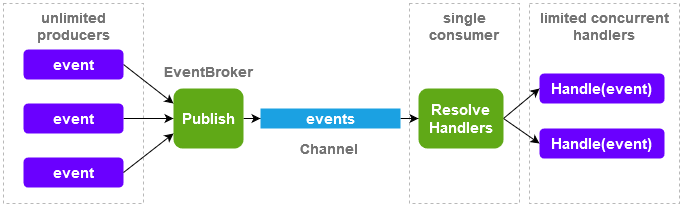

# EventBrokerSlim  
  

[](https://github.com/petar-m/EventBrokerSlim/actions)
[](https://www.nuget.org/packages/M.EventBrokerSlim)    

An implementation of broadcasting events in a fire-and-forget style.  

This was supposed to be next vesion of [EventBroker](https://github.com/petar-m/EventBroker), however it diverged so much than it became its own package.  
It is trimmed down to minimum public surface and essential functionality.

It still is:
- in-memory, in-process
- publishing is *Fire and Forget* style  
- events don't need to implement specific interface  
- event handlers are runned on background threads  

And also:
- events are handled on a ThreadPool threads
- tightly integrated with Microsoft.Extensions.DependencyInjection
- each handler is resolved and runned in a new DI container scope

# How does it work

Implement an event handler by implementing `IEventHadler<TEvent>` interface:

```csharp
public record SomeEvent(string Message);

public class SomeEventHandler : IEventHandler<SomeEvent>
{
    // Inject services added to the DI container
    public SomeEventHandler()
    {
    }

    public async Task Handle(SomeEvent @event)
    {
        // process the event
    }

    public async Task OnError(Exception exception, SomeEvent @event)
    {
        // called on unhandled exeption from Handle 
    }
}
```

Add event broker impelementation to DI container using `AddEventBroker` extension method and register handlers:

```csharp
serviceCollection.AddEventBroker(
     x => x.AddKeyedTransient<SomeEvent, SomeEventHandler>());
```

Inject `IEventBroker` and publish events:

```csharp
class MyClass
{
    private readonly IEventBroker _eventBroker;

    public MyClass(IEventBroker eventBroker)
    {
        _eventBroker = eventBroker;
    }
    
    public async Task DoSomething()
    {
        var someEvent = new SomeEvent("Something happened");
        await _eventBroker.Publish(someEvent);
    }
}
```

# Design  

EventBroker uses `System.Threading.Channels.Channel<T>` to decouple procucers and consumers.  

There are no limits for publishers. Publishing is as fast as writing an event to a channel.  

Event handlers are resolved by event type in a new scope which is disposed after handler comletes. Each handler execution is scheduled on the ThreadPool. No more than configured maximum handlers run concurrently.
  


# Details

## Events

Events can be of any type. A best pracice for event is to be immutable - may be processed by multiple handlers in different threads.  

## Event Handlers

Event handlers have to implement `IEventHandler<TEvent>` interface and to be registered in the DI container.  
For each event handler a new DI container scope is created and the event handler is resolved from it. This way it can safely use injected services.  
Every event handler is executed on a background thread.

## Configuration  

EventBroker is depending on `Microsoft.Extentions.DependencyInjection` container for resolving event handlers.  
It guarantees that each handler is resolved in a new scope which is disposed after the handler completes.  

EventBroker is configured with `AddEventBroker` and `AddEventHandlers` extension methods of `IServiceCollection` using a confiuration delegate.  
Event handlers are registered by the event type and a corresponding `IEventHandler` implementation as transient, scoped, or singleton.  

*Example:*
```csharp
services.AddEventBroker(
    x => x.WithMaxConcurrentHandlers(3)
          .DisableMissingHandlerWarningLog()
          .AddKeyedTransient<Event1, EventHandler1>()
          .AddKeyedScoped<Event2, EventHandler2>()
          .AddKeyedSingleton<Event3, EventHandler3>())
```  

`WithMaxConcurrentHandlers` defines how many handlers can run at the same time. Default is 2.  

`DisableMissingHandlerWarningLog` suppresses logging warning when there is no handler found for event.  

EventBroker behavior and event handlers can be configured with separate extension methods. The order of calls to `AddEventBroker` and `AddEventHandlers` does not matter. 

*Example:*
```csharp
services.AddEventBroker(
            x => x.WithMaxConcurrentHandlers(3)
                  .DisableMissingHandlerWarningLog());

services.AddEventHandlers(
            x => x.AddKeyedTransient<Event1, EventHandler1>()
                  .AddKeyedScoped<Event2, EventHandler2>()
                  .AddKeyedSingleton<Event3, EventHandler3>())
```  

There can be multiple handlers for the same event.  

The `AddKeyed*` naming may be confusing since no key is provided. This comes from the need to create a scope and resolve the handler from this scope. Since there can be multiple implementations of the same interface, `GetService` or `GetServices` will get either the last one registered or all of them. This is solved by internally generating a key and registering each handler as keyed service. Then exactly one keyed service (event handler) is resolved per scope.  


Note that handlers not registered using `AddEventBroker` or `AddEventHandlers` methods will be ignored by EventBroker.


## Publishing Events  

`IEventBroker` and its implementation are registered in the DI container by the `AddEventBroker` method.

Events are published using `IEventBroker.Publish` method.

Events can be published after given time interval with `IEventBroker.PublishDeferred` method.

**Caution**: `PublishDeferred` may not be accurate and may perform badly if large amount of deferred messages are scheduled. It runs a new task that in turn uses `Task.Delay` and then publishes the event.  
A lot of `Task.Delay` means a lot of timers waiting in a queue.

## Exception Handling  

Since event handlers are executed on background threads, there is nowhere to propagate unhandled ecxeptions.  

An exception thrown from `Handle` method is caught and passed to `OnError` method of the same handler instance (may be on another thread however).  

An exception thrown from `OnError` is handled and swallowed and potentially logged.  

## Logging  

If there is logging configured in the DI container, EventBroker will use it to log when:  
- There is no event handler found for published event (warning). Can be disabled with `DisableMissingHandlerWarningLog()` during configuration.  
- Exception is thrown during event handler resolving (error).
- Exception is thrown from handlers `OnError()` method (error).  

If there is no logger configured, these exceptions will be handled and swallowed.
