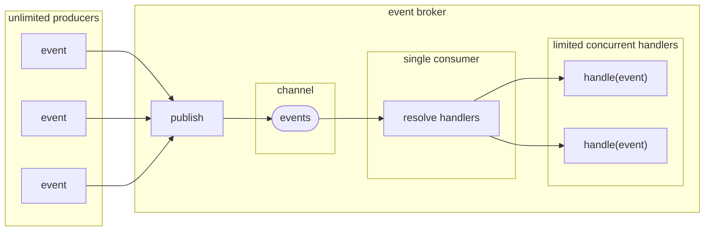

# EventBrokerSlim  
  

[](https://github.com/petar-m/EventBrokerSlim/actions)
[](https://www.nuget.org/packages/M.EventBrokerSlim)    

An implementation of broadcasting events in a fire-and-forget style.  

Features:  
- in-memory, in-process
- publishing is *Fire and Forget* style  
- events don't have to implement specific interface  
- event handlers are executed on a `ThreadPool` threads  
- the number of concurrent handlers running can be limited  
- built-in retry option
- tightly integrated with Microsoft.Extensions.DependencyInjection
- each handler is resolved and executed in a new DI container scope
- **NEW** event handlers can be delegates  
- **NEW** dynamic delegate event handlers  

# How does it work

Implement an event handler by implementing `IEventHandler<TEvent>` interface:

```csharp
public record SomeEvent(string Message);

public class SomeEventHandler : IEventHandler<SomeEvent>
{
    // Inject services added to the DI container
    public SomeEventHandler()
    {
    }

    public async Task Handle(SomeEvent @event, IRetryPolicy retryPolicy, CancellationToken cancellationToken)
    {
        // process the event
    }

    public async Task OnError(Exception exception, SomeEvent @event, IRetryPolicy retryPolicy, CancellationToken cancellationToken)
    {
        // called on unhandled exception from Handle 
        // optionally use retryPolicy.RetryAfter(TimeSpan)
    }
}
```  

or use `DelegateHandlerRegistryBuilder` to register delegate as handler: 

```csharp
DelegateHandlerRegistryBuilder builder = new();
builder.RegisterHandler<SomeEvent>(
    static async (SomeEvent someEvent, ISomeService service, CancellationToken cancellationToken) =>
    {
        await service.DoSomething(someEvent, cancellationToken);
    });
```  

Add event broker implementation to DI container using `AddEventBroker` extension method and register handlers, optionally add delegate handler registries:

```csharp
serviceCollection.AddEventBroker(x => x.AddTransient<SomeEvent, SomeEventHandler>())
                 .AddSingleton(builder);
```

Inject `IEventBroker` and publish events:

```csharp
class MyClass
{
    private readonly IEventBroker _eventBroker;

    public MyClass(IEventBroker eventBroker)
    {
        _eventBroker = eventBroker;
    }
    
    public async Task DoSomething()
    {
        var someEvent = new SomeEvent("Something happened");
        await _eventBroker.Publish(someEvent);
    }
}
```

# Overview  

`EventBroker` uses `System.Threading.Channels.Channel<T>` to decouple producers from consumers.  

There are no limits for publishers. Publishing is as fast as writing an event to a channel.  

Event handlers are resolved by event type in a new DI scope which is disposed after handler completes. Each handler execution is scheduled on the `ThreadPool` without blocking the producer. No more than configured maximum handlers run concurrently.
  


# Details

## Events

Events can be of any type. A best practice for event is to be immutable - may be processed by multiple handlers in different threads.  

## Event Handlers

Event handlers can be specified in two ways:
- By implementing `IEventHandler<TEvent>` interface and registering the implementation in the DI container.
- By registering a handler delegate using `DelegateHandlerRegistryBuilder` and adding the  `DelegateHandlerRegistryBuilder` instance to the DI container.  

Both approaches can be used side by side, even for the same event. No matter how handlers are specified, a new DI container scope is created for each event handler. Every event handler is scheduled for execution on the `ThreadPool` without blocking the producer.  

### Event Handlers Implementing `IEventHandler<TEvent>`  

When event of type `TEvent` is published, `EventBroker` will resolve each `IEventHandler<TEvent>` implementation from a dedicated scope. This means that additional dependencies can be injected via the handler constructor, also resolved from the same scope.  

The parameters of `IEventHandler<TEvent>` methods are managed by `EventBroker`.  
```csharp
Task Handle(TEvent @event, IRetryPolicy retryPolicy, CancellationToken cancellationToken);

Task OnError(Exception exception, TEvent @event, IRetryPolicy retryPolicy, CancellationToken cancellationToken);
```
- `TEvent` - the instance of the published event.  
- `IRetryPolicy` - the instance of the retry policy for the handler (see [Retries](#retries) section).
- `CancellationToken` - the `EventBroker` cancellation token.
- `Exception` - exception thrown from `Handle`.

Since event handlers are executed on the `ThreadPool`, there is nowhere to propagate unhandled exceptions.  
An exception thrown from `Handle` method is caught and passed to `OnError` method of the same handler instance (may be on another thread however).  
An exception thrown from `OnError` is handled and swallowed and potentially logged (see [Logging](#logging) section).  

### Delegate Event Handlers

Delegate handlers are registered using `DelegateHandlerRegistryBuilder` against event type.   

```csharp
DelegateHandlerRegistryBuilder builder = new();
builder.RegisterHandler<SomeEvent>(
    static async (SomeEvent someEvent, ISomeService someService) =>
    {
        await someService.DoSomething();
    });
```

Registered delegate must return a `Task`. Delegate can have 0 to 16 parameters. All of them will be resolved from DI container scope and passed when the delegate is invoked.  
There are few special cases of optional parameters managed by `EventBroker` (without being registered in DI container):  
- `TEvent`  - an instance of the event being handled. Should match the type of the event the delegate was registered for.
- `IRetryPolicy` - the instance of the retry policy for the handler (see [Retries](#retries) section).
- `CancellationToken` - the `EventBroker` cancellation token. 
- `INextHandler` - used to call the next wrapper in the chain or the handler if no more wrappers available (see below).

Delegate handlers do not provide special exception handling. Exception caused by resolving services or  unhandled exception during execution will be handled and swallowed and potentially logged (see [Logging](#logging) section).  

Delegate handlers registration has a decorator-like feature allowing to pipeline multiple delegates. The `INextHandler` instance is used to call the next in the pipeline.   

```csharp
builder.RegisterHandler<SomeEvent>(
            static async (SomeEvent someEvent, ISomeService someService) => await someService.DoSomething())
       .WrapWith(
            static async (INextHandler next, ILogger logger)
            {
                try
                {
                    await next.Execute();
                }
                catch(Exception ex)
                {
                    logger.LogError(ex);
                }
            })
       .WrapWith(
            static async (SomeEvent someEvent, ILogger logger)
            {
                Stopwatch timer = new();
                await next.Execute();
                timer.Stop();
                logger.LogInformation("{event} handling duration {elapsed}", someEvent, timer.Elapsed);
            });            
```

Delegate wrappers are executed from the last registered moving "inwards" toward the handler.  

### Dynamic Delegate Event Handlers 

Delegate handlers can be added or removed after DI container was built. Dynamic delegate handlers are created using `DelegateHandlerRegistryBuilder` and support all delegate handler features (retries, wrappers, etc.).  

EventBroker registration adds `IDynamicEventHandlers` which is used for managing handlers. Adding handlers returns `IDynamicHandlerClaimTicket` used to remove the handlers.  Since `DelegateHandlerRegistryBuilder` can define multiple handlers, all of them will be removed by the `IDynamicHandlerClaimTicket` instance.  

```csharp
public class DynamicEventHandlerExample : IDisposable
{
    private readonly IDynamicEventHandlers _dynamicEventHandlers;
    private readonly IDynamicHandlerClaimTicket _claimTicket;

    public DynamicEventHandlerExample(IDynamicEventHandlers dynamicEventHandlers)
    {
        _dynamicEventHandlers = dynamicEventHandlers;

        DelegateHandlerRegistryBuilder handlerRegistryBuilder = new();
        
        // Define two handlers for different events
        handlerRegistryBuilder
            .RegisterHandler<Event1>(HandleEvent1)
            .Builder()
            .RegisterHandler<Event2>(HandleEvent2);

        // Register with the event broker and keep a claim ticket
        _claimTicket = _dynamicEventHandlers.Add(handlerRegistryBuilder);
    }

    // All delegate features are available, including injecting services registered in DI
    private async Task HandleEvent1(Event1 event1, IRetryPolicy retryPolicy, ISomeService someService)
    {
        // event processing 
    }

    private async Task HandleEvent2(Event2 event2)
    {
        // event processing 
    }

    public void Dispose()
    {
        // Remove both event handlers using the IDynamicHandlerClaimTicket
        _dynamicEventHandlers.Remove(_claimTicket);
    }
}

```
> [!IMPORTANT]
> Make sure handlers are removed if containing classes are ephemeral. 

## DI Configuration  

`EventBroker` is depending on `Microsoft.Extensions.DependencyInjection` container for resolving event handlers and their dependencies. It guarantees that each handler is resolved in a new scope, disposed after the handler completes. There can be multiple handlers for the same event.    

`EventBroker` is configured with `AddEventBroker` extension method of `IServiceCollection` using a configuration delegate.  

```csharp
services.AddEventBroker(x => x.WithMaxConcurrentHandlers(3)
                              .DisableMissingHandlerWarningLog());
```  

`WithMaxConcurrentHandlers` defines how many handlers can run at the same time. Default is 2.  

`DisableMissingHandlerWarningLog` suppresses logging warning when there is no handler found for event.  

### Handlers Implementing `IEventHandler<TEvent>`

Event handlers are registered by the event type and a corresponding `IEventHandler` implementation as transient, scoped, or singleton. `AddEventHandlers` extension method of `IServiceCollection` provides a configuration delegate.  

```csharp
services.AddEventHandlers(
            x => x.AddTransient<Event1, EventHandler1>()
                  .AddScoped<Event2, EventHandler2>()
                  .AddSingleton<Event3, EventHandler3>())
```  

Handler implementations can also be registered in the `AddEventBroker` method.  

```csharp
services.AddEventBroker(x => x.WithMaxConcurrentHandlers(3)
                              .DisableMissingHandlerWarningLog()
                              .AddTransient<Event1, EventHandler1>()
                              .AddScoped<Event2, EventHandler2>()
                              .AddSingleton<Event3, EventHandler3>());
```
The order of calls to `AddEventBroker` and `AddEventHandlers` does not matter. `AddEventHandlers` can be called multiple times.  

> [!WARNING]
> Handlers **not** registered using `AddEventBroker` or `AddEventHandlers` methods will be **ignored** by `EventBroker`.  

### Delegate Handlers

Delegate event handlers are registered using  `DelegateHandlerRegistryBuilder` instance.  

```csharp
DelegateHandlerRegistryBuilder builder = new();
builder.RegisterHandler<SomeEvent>(
    static async (SomeEvent someEvent, ISomeService someService) =>
    {
        await someService.DoSomething();
    });

services.AddSingleton(builder);    
```  

Multiple `DelegateHandlerRegistryBuilder` instances can be registered. Delegate handlers can be registered after the service collection has been built.  

Registrations after `IEventBroker` instance is resolved are not allowed.

## Publishing Events  

Events are published using `IEventBroker.Publish` method.

Events can be published after given time interval with `IEventBroker.PublishDeferred` method.

**Caution**: `PublishDeferred` may not be accurate and may perform badly if large amount of deferred messages are scheduled. It runs a new task that in turn uses `Task.Delay` and then publishes the event.  
A lot of `Task.Delay` means a lot of timers waiting in a queue.

## Logging  

If there is `ILogger` configured in the DI container, `EventBroker` will use it to log when:  
- There is no event handler found for published event (warning). Can be disabled with `DisableMissingHandlerWarningLog()` during configuration.  
- Exception is thrown during event handler resolving (error).
- Exception is thrown from handlers `OnError()` method (error).  
- Exception is thrown from delegate handler (error).  

If there is no logger configured, these exceptions will be handled and swallowed.
  
## Retries  

Retrying within event handler can become a bottleneck. Imagine `EventBroker` is restricted to one concurrent handler. An exception is caught in `Handle` and retry is attempted after given time interval. Since `Handle` is not completed, there is no available "slot" to run other handlers while `Handle` is waiting.  

Another option will be to use `IEventBroker.PublishDeferred`. This will eliminate the bottleneck but will introduce different problems. The same event will be handled again by all handlers, meaning special care should be taken to make all handlers idempotent. Any additional information (e.g. number of retries) needs to be known, it should be carried with the event, introducing accidental complexity.  

To avoid these problems, both `IEventBroker` `Handle` and `OnError` methods have `IRetryPolicy` parameter. It is also available for delegate handlers. 

 `IRetryPolicy.RetryAfter()` will schedule a retry only for the handler it is called from, without blocking. After the given time interval an instance of the handler will be resolved from the DI container (from a new scope) and executed with the same event instance.

`IRetryPolicy.Attempt` is the current retry attempt for a given handler and event.  
`IRetryPolicy.LastDelay` is the time interval before the retry.  

`IRetryPolicy.RetryRequested` is used to coordinate retry request between `Handle` and `OnError`. `IRetryPolicy` is passed to both methods to enable error handling and retry request entirely in `Handle` method. `OnError` can check `IRetryPolicy.RetryRequested` to know whether `Handle` had called `IRetryPolicy.RetryAfter()`.  

If added as a parameter, the `IRetryPolicy` will be passed to delegate wrappers and handler. It has the same behavior, allowing delegate handlers to be retired too.

> [!WARNING] 
> Retry will not be exactly after the specified time interval in `IRetryPolicy.RetryAfter()`. Take into account a tolerance of around 50 milliseconds. Additionally, retry executions respect maximum concurrent handlers setting, meaning a high load can cause additional delay.

